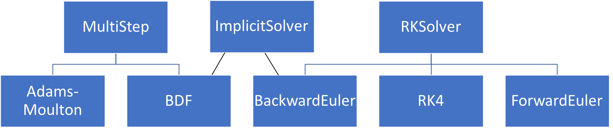

---
jupytext:
  formats: md:myst
  text_representation:
      extension: .md
      format_name: myst
kernelspec:
  display_name: Python 3
  language: python
  name: python3
---
(designing-oop-programs)=
# Designing Object-Oriented Programs

In this section, we will go more into the theoretical basis of object-oriented programming and cover more concepts and ideas used in designing object-orient code.


(four-pillars-oop)=
## The four pillars of OOP
The "four pillars" are central concepts when designing object-oriented programs. These are:

* **Abstraction**: to extract the essential features of objects we use into a common abstract concept (i.e., a class).
* **Encapsulation**: collecting all the data and functionality into a single class accessed through a well-defined interface.
* **Inheritance**: defining new classes based on existing classes.
* **Polymorphism**: the idea that an object or a function can have different behavior based on the context.

### Abstraction

Abstraction means extracting the essential features of objects we use into a common abstract concept (i.e., a class). As part of the abstraction, we also decouple how something is used from how it is implemented and only need to focus on the implementation when developing the class. We can hide unnecessary or complex details, exposing only a clean interface externally. Abstraction reduces overall code complexity and makes code easier to understand. Abstraction is essential in modern software systems since it would be impossible to deal with the complexity of modern systems while still keeping track of all details down to the level of single bits. For instance, we work with integers and floating point numbers as abstract quantities without knowing how these are represented on the computer.

### Encapsulation

Encapsulation means collecting all the data and functionality into a single class. The concept of encapsulation is related to and somewhat overlapping with abstraction in that we "encapsulate" details inside a class, exposing only the easy-to-use interface. Encapsulation also encompasses hiding data inside classes that the external user never interacts with directly or sees. An essential goal of proper encapsulation is that the internal data structures of a class may be changed entirely, but as long as the interface is untouched, all code using the class will still work.
We use floating point numbers continuously in our codes, but only through the defined Python operators, never
manipulating the actual number representation in memory. Therefore, our codes still work even if the standard for floating point number representation is changed (which has happened several times throughout history).


### Inheritance

Inheritance means defining new classes based on existing classes. Inheritance is useful because it lets us avoid re-implementing the same methods and behaviors multiple times. It also creates a clear *hierarchy* in the classes, which can be used to structure code. Inheritance can be seen as a central tool for *abstraction* since the class hierarchies will (should) often map to natural hierarchical relations between different concepts. Consider an example from daily life; in most contexts, it is sufficient to think of a car simply as a car, while for other applications, one might need to know the brand, model, etc. The same is true in many programming applications, and inheritance provides the tools for handling these relations.

### Polymorphism

Polymorphism is perhaps the most delicate concept, but it means an object can behave differently based on context. A Blu-ray player can read both a Blu-ray disc and a DVD. On a technical level, these are very different, while the user can simply use both the same way. This would be an example of polymorphic behavior. Similarly, we can define a method that can take input of different types, for example, an integer *or* a list of integers. The concept of polymorphism is tightly coupled to inheritance and class hierarchies in *statically typed languages*, where input arguments to a function are required to be of a specific type. With dynamic typing in Python, polymorphic behavior can also be achieved with other methods, but using class hierarchies and OOP often leads to better-structured and more readable code. By making polymorphic classes, we can generalize our classes so they can be easier to use.

In reality, the *four pillars* are closely related and partly overlapping concepts. For instance, polymorphism is typically implemented through inheritance, and inheritance is also a key tool for abstractions that have a natural hierarchy.

### A simple example to illustrate the four pillars

A general problem when introducing OOP is that the ideas are most useful for large programs. For simple example codes that are practical to use in courses, the benefit of OOP is typically rather small. Seeing the real value of OOP requires some ability to extrapolate and imagine how code designs and implementations will scale to systems with thousands of code lines.

Here is a simple example to illustrate the four pillars. Suppose we have a program that uses matrices, vectors, and matrix-vector products. Vectors and matrices are conveniently stored as NumPy arrays

```{code-cell} python
# matrices and vectors are easily represented as numpy arrays
import numpy as np

# create some arbitrary matrix A
A = np.array([[i + j for i in range(1, 4)] for j in range(1, 4)])
print(A)

# some vector x
x = np.array([1, 0, 0])

# compute and print the product b=Ax
b = np.matmul(A, x)
print(b)
```

The code works as intended but completely ignores that a matrix is a well-defined and useful mathematical concept with a strictly defined set of permitted operations. If our code were longer and used multiple matrices, explicitly representing the abstract concept of a matrix would make the code far more readable. For that purpose, it is natural to use a class that holds the matrix data and defines associated operations


```{code-cell} python
class Matrix:
    def __init__(self, data):
        self._data = data

    def __str__(self):
        return str(self._data)

    def __repr__(self):
        return f"{type(self).__name__}(data={self._data})"

    def mul(self, x):
        return np.matmul(self._data, x)


values = np.array([[i + j for i in range(1, 4)] for j in range(1, 4)])
A = Matrix(values)
print(A)

x = np.array([1, 0, 0])
b = A.mul(x)

print(b)
```

Not much has been gained from using OOP in this simple code, but it should be easy to see the potential benefits for larger systems. The incredibly useful branch of mathematics known as linear algebra would be impossible to understand without the abstract concept of a matrix. Adding the right abstraction to a code may have similar implications for its readability.

In our matrix example, it makes sense to consider the third pillar, *inheritance*, before looking at the second. Assume that many of the matrices used in our program are diagonal. It is very inefficient to compute a matrix-vector product involving a large diagonal matrix as if the matrix was full. To avoid unnecessary code duplication, we can introduce the diagonal matrix as a sub-class


```{code-cell} python
class MatDiag(Matrix):
    def mul(self, x):
        return np.diagonal(self._data) * x


d = [2, 4, 6]
A = MatDiag(np.diag(d))
print(A)

x = np.array([1, 0, 0])
b = A.mul(x)
print(b)
```

While this class works, it is not well-suited for large matrices since we store many zeroes ($(n\times n) - n$ for an $n\times n$ matrix). We can create a more memory-friendly version of the `MatDiag` class and at the same time, illustrate *encapsulation*

```{code-cell} python
class MatDiag(Matrix):
    def __init__(self, data):
        if data.ndim == 1:
            self._data = data
        elif data.ndim == 2:
            self._data = np.diagonal(data)

    def mul(self, x):
        return self._data * x


d = [2, 4, 6]
A = MatDiag(np.diag(d))
print(A)

x = np.array([1, 0, 0])
b = A.mul(x)
print(b)
```

The main change to the class is that we only store the non-zero diagonal elements. Note also that we use the standard convention of a leading underscore on the attribute `_data`, to indicate to users of the class that this item is not to be manipulated directly. Our change of internal data structure has implications for the implementation of the constructor and the `mul` function, but users of the class will not see these changes. The class interface is not changed, and all codes that use the class will work without changes. Also note that `np.diag()` is a NumPy function that returns a diagonal matrix, given a vector, while `np.diagonal()` returns a vector of the diagonal, given a matrix.

The fourth and final pillar, *polymorphism*, can be illustrated by the following example code, where we want to solve the linear system `Ax = b`. Of course, this can be done for both full and diagonal matrices. However, if we care about efficiency, we should utilize the matrix structure, just as we did for the matrix multiplication above. The following function implements a naive solution:

```{code-cell} python
"""
Note: intentionally bad coding style, breaks encapsulation
"""


def solve(A, b):
    """Solves Ax=b wrt x, choosing the
    algorithm based on the structure of A"""
    if isinstance(A, MatDiag):
        x = b / A._data
    elif isinstance(A, Matrix):
        x = np.matmul(np.linalg.inv(A._data), b)

    return x


d = [2, 4, 6]
A0 = MatDiag(np.diag(d))
A1 = Matrix(np.eye(3) + np.ones((3, 3)))
print(A0)
print(A1)
```

There are two main reasons to change this code. The first is that encapsulation is broken since the function directly accesses the internal matrix data structures. The second one is that we use `isinstance` tests to determine the behavior. Both problems can be solved by moving the `solve` function inside the classes and allowing the object itself to determine what function to call. The complete implementation of the classes and the function may look like

```{code-cell} python
class Matrix:
    def __init__(self, data):
        self._data = data

    def __str__(self):
        return str(self._data)

    def __repr__(self):
        return f"{type(self).__name__}(data={self._data})"

    def mul(self, x):
        return np.matmul(self._data, x)

    def solve(self, b):
        return np.matmul(np.linalg.inv(_data), b)
```

```{code-cell} python
class MatDiag(Matrix):
    def __init__(self, data):
        if data.ndim == 1:
            self._data = data
        elif data.ndim == 2:
            self._data = np.diagonal(data)

    def mul(self, x):
        return self._data * x

    def solve(self, b):
        return b / self._data
```

```{code-cell} python
def solve(A, b):
    return A.solve(b)


d = [2, 4, 6]
A0 = MatDiag(np.diag(d))
print(A0)
print(A0._data)

print(solve(A0, np.array([1, 1, 1])))
```

Polymorphism implemented through class hierarchies becomes *even more important in statically typed languages*. For instance, if we were to implement something like the `solve` function above in C++, we would have to specify the type of the arguments `A` and `b`. If we specified `A` as an instance of the `Matrix` base class, the function would accept objects of all sub-classes as arguments, and things would work exactly as in Python.

(abstract-base-classes)=
### Abstract base classes
Let us go back to the `Matrix` example and think about what we just did. First, what is the difference between a regular and a diagonal matrix? It is the `mul` method and the `solve` method. If we want to implement yet another matrix, we would need to implement new versions of `mul` and `solve`. However, for a developer from the outside, it is not so apparent that they must implement both methods. One way to make this more explicit is to implement a base class, say `BaseMatrix`. This base class should contain the methods we want to ensure are implemented by any matrix class. This can be achieved by implementing `BaseMatrix` as a regular class. We raise a `NotImplementedError` when the needed methods are not implemented.

```{code-cell} python
class BaseMatrix:
    def __init__(self, data: np.ndarray) -> None:
        self._data = data

    def __str__(self) -> str:
        return str(self._data)

    def __repr__(self) -> str:
        return f"{type(self).__name__}(data={self._data})"

    def mul(self, x: np.ndarray) -> np.ndarray:
        raise NotImplementedError

    def solve(self, b: np.ndarray) -> np.ndarray:
        raise NotImplementedError
```

Now, if we create a matrix by deriving from this class, we will get an error if we forgot to implement the required methods

```{code-cell} python
class Matrix(BaseMatrix):
    # We only implemented the `solve` method, but forgot `mul`
    def solve(self, b):
        return np.matmul(np.linalg.inv(_data), b)


values = np.array([[i + j for i in range(1, 4)] for j in range(1, 4)])
A = Matrix(values)
print(A)

x = np.array([1, 0, 0])
b = A.mul(x)
```

This is useful because it is now well communicated to anyone who wants to create a new matrix class that they must implement the methods that raise a `NotImplementedError`. However, nothing prevents us from creating and instantiating a new class. We also say that we first got an error when the method was called (in this case, the `mul` method). It would be much better if we got this error message earlier, i.e., when we instantiate a class.

This can be achieved by implementing the `BaseMatrix` as an abstract base class.

```{code-cell} python
import abc


class BaseMatrix(abc.ABC):
    def __init__(self, data: np.ndarray) -> None:
        self._data = data

    def __str__(self) -> str:
        return str(self._data)

    def __repr__(self) -> str:
        return f"{type(self).__name__}(data={self._data})"

    @abc.abstractmethod
    def mul(self, x: np.ndarray) -> np.ndarray:
        ...

    @abc.abstractmethod
    def solve(self, b: np.ndarray) -> np.ndarray:
        ...
```
The first thing to note is that we import a new module called `abc` and create a new class called `BaseMatrix` that inherits from `abc.ABC`. "abc" stands for *abstract base class*. Inheriting from `abc.ABC` creates an abstract base class. We also define the `__init__`, `__str__`  and `__repr__` method as we did before. Those methods have not changed (except that we added some {ref}`type-annotations`). For `mul` and `solve` we see something different. First of all, there is no implementation of them. Here we have used the ellipsis (`...`) as a placeholder, but we could also have used `pass`, e.g
```python
@abc.abstractmethod
def mul(self, x: np.ndarray) -> np.ndarray:
    pass
```
The key here is that these methods need to be implemented by any class that inherits from this abstract base class. This is done by marking the method as an abstract method by decorating it with `@abc.abstractmethod`. Why is this important?
Consider the `solve` function (here with type annotations).

```{code-cell} python
def solve(A: BaseMatrix, b: np.ndarray) -> np.ndarray:
    return A.solve(b)
```
This function expects as the first argument a `BaseMatrix`. More specifically, it expects an object with a method called `solve` that takes an argument `b`, which is a NumPy array. The method should also return a NumPy array. If we can ensure that any new classes for matrices inherit from the `BaseMatrix` class, we know that they will require an implementation of this `solve` method.

Let us first try to create an invalid matrix class that inherits from this abstract base class but that does not implement both of the abstract methods, e.g.

```{code-cell} python
class InvalidMatrix(BaseMatrix):
    def mul(self, x):
        return np.matmul(self._data, x)
```
Now let us see what happens if we try to create a new instance of the class
```{code-cell} python
values = np.array([[i + j for i in range(1, 4)] for j in range(1, 4)])
A = InvalidMatrix(values)
```
We are not allowed to create an instance because we forgot to implement the abstract method `solve`. Now, let us implement `Matrix` and `MatDiag` by inheriting from the `BaseMatrix` class

```{code-cell} python
class Matrix(BaseMatrix):
    def mul(self, x):
        return np.matmul(self._data, x)

    def solve(self, b):
        return np.matmul(np.linalg.inv(self._data), b)


class MatDiag(BaseMatrix):
    def __init__(self, data):
        if data.ndim == 1:
            self._data = data
        elif data.ndim == 2:
            self._data = np.diagonal(data)

    def mul(self, x):
        return self._data * x

    def solve(self, b):
        return b / self._data


values = np.array([[i + j for i in range(1, 4)] for j in range(1, 4)])
A1 = Matrix(values)
A2 = MatDiag(np.diag(values))
```

### Pokémon Go - revisited
Let us recall the Pokémon Go example in {ref}`pokemon-example`, which had a base class looking like this

```{code-cell} python
import numpy as np


class Pokemon:
    def __init__(self):
        self.IV_ATK = np.random.randint(16)
        self.IV_STA = np.random.randint(16)
        self.IV_DEF = np.random.randint(16)

    @property
    def ATK(self):
        return self.BASE_ATK + self.IV_ATK

    @property
    def DEF(self):
        return self.BASE_DEF + self.IV_DEF

    @property
    def STA(self):
        return self.BASE_STA + self.IV_STA

    def __str__(self):
        return f"{self.__class__.__name__}({self.ATK}, {self.DEF}, {self.STA})"
```

One would make a specific Pokémon by providing an explicit implementation of `BASE_ATK`, `BASE_DEF` and `BASE_STA`, e.g.,

```{code-cell} python
class Pikachu(Pokemon):
    BASE_ATK = 112
    BASE_DEF = 101
    BASE_STA = 70
```
In this case, we do not want to create a Pokemon that does not provide an implementation of `BASE_ATK`, `BASE_DEF` and `BASE_STA` because that will make the program fail, e.g.,

```{code-cell} python
class InvalidPokemon(Pokemon):
    BASE_ATK = 112
    BASE_DEF = 101


p = InvalidPokemon()
print(p)
```

What can we do? We can implement the `Pokemon` class as an abstract base class, something like


```{code-cell} python
import abc


class Pokemon(abc.ABC):
    def __init__(self):
        self.IV_ATK = np.random.randint(16)
        self.IV_STA = np.random.randint(16)
        self.IV_DEF = np.random.randint(16)

    @property
    @abc.abstractmethod
    def BASE_ATK(self):
        ...

    @property
    @abc.abstractmethod
    def BASE_DEF(self):
        ...

    @property
    @abc.abstractmethod
    def BASE_STA(self):
        ...

    @property
    def ATK(self):
        return self.BASE_ATK + self.IV_ATK

    @property
    def DEF(self):
        return self.BASE_DEF + self.IV_DEF

    @property
    def STA(self):
        return self.BASE_STA + self.IV_STA

    def __str__(self):
        return f"{type(self).__name__}({self.ATK}, {self.DEF}, {self.STA})"
```

We have indicated that `BASE_ATK`, `BASE_DEF` and `BASE_STA` should be abstract methods. We have also specified that they should be `properties` by adding a `@property` decorator on top of the `@abc.abstractmethod` decorator. Now we should be able to do this

```{code-cell} python
class Pikachu(Pokemon):
    BASE_ATK = 112
    BASE_DEF = 101
    BASE_STA = 70


p = Pikachu()
print(p)
```
But this would raise a TypeError when trying to create a new instance since `BASE_STA` is not implemented

```{code-cell} python
class InvalidPokemon(Pokemon):
    BASE_ATK = 112
    BASE_DEF = 101


p = InvalidPokemon()
print(p)
```


### Other important OOP concepts
* **Multi-level inheritance** is a class hierarchy with several levels of sub-classes. For instance, we could introduce band matrix as a subclass of `Matrix` and diagonal matrix as a subclass of band matrix.
* **Multiple inheritance**: when one subclass inherits from several base classes, defined by listing all of them in the class definition; `class SubClass(Base1, Base2):`.
* **Method resolution order (MRO)** are the rules determining the order in which Python looks for methods and data in a class hierarchy. Python will generally progress down to up in the class hierarchy and from left to right in the case of multiple inheritances.
* **Method overriding** is the process of writing a different function in a sub-class, which overrides the corresponding method in the base class (like the `mul` and `solve` methods in the `MatDiag` class above).
* **Abstract class** is a base class that is only used to implement common features for classes that inherit from it. We generally never create instances of abstract classes. An example is the *cosmic base class* `object` in Python.
* **Virtual method** is an overrideable method. It is declared as *virtual* in the base class and can be overridden in subclasses. In Python, all methods are virtual by default, but this is not the case for Java and C++.


```{code-cell} python
# Example: multilevel inheritance


class Organism:
    pass


class Animal(Organism):
    pass


class Herbivore(Animal):
    pass


class Carnivore(Animal):
    pass


class Sheep(Herbivore):
    pass


class Wolf(Carnivore):
    pass


dolly = Sheep()

print(isinstance(dolly, Animal))
```

Inheritance implies an *is a* relationship. A herbivore *is an* animal, which in turn *is an* organism.

Note that while `isinstance` checks whether a given object instance belongs to a given class, there is also a `issubclass` that can be used on class objects. So one can, for example, check that a Herbivore is an animal.

### Note: Constructors in class hierarchies

The following is true for subclasses
* The subclass automatically has all the same methods as the superclass, including the constructor
* The subclass can redefine (overwrite) any inherited method
* The subclass can define new methods

However, if a subclass wants to extend the constructor of its superclass, we might run into problems


```{code-cell} python
class Car:
    """Store information about a car"""

    def __init__(self, brand, model, plate_nr, color, milage):
        self.brand = brand
        self.model = model
        self.plate_nr = plate_nr
        self.color = color
        self.milage = milage
```

We now want to create ElectricCar, as a subclass of Car. The only difference is that we want to add information about the battery capacity of the electric car. We want this information to go into the constructor.

Challenge: We want to get away without re-implementing the whole constructor. This is part of the motivation behind inheritance in the first place (DRY: Don't repeat yourself.)

Let us first look at the 'naive' solution


```{code-cell} python
class ElectricCar(Car):
    def __init__(self, brand, model, plate_nr, color, milage, battery):
        self.battery = battery
```

This would be great (if it worked) because we only need to add the new information of the subclass without repeating all the old information. The problem is that when we create the `__init__`-method in the `ElectricCar`-class, we overwrite the Car method that was inherited in the first place. Thus, the new constructor would *only* remember the battery, not any of the other information.

To get around this, we can explicitly call the superclasses' init function directly.

```{code-cell} python
class ElectricCar(Car):
    def __init__(self, brand, model, plate_nr, color, milage, battery):
        Car.__init__(self, brand, model, plate_nr, color, milage)
        self.battery = battery


tesla = ElectricCar("tesla", "model s", "EL12345", "blue", 1000, 75)
```

This way, we can use the old constructor but add additional steps when constructing the object.

As in earlier examples, we want to avoid hard-coding in specific class names in case we change them later or use inheritance. To do this, we replace `Car.__init__` with `super().__init__`. `super` is a built-in Python function that refers to the superclass when used within a subclass. So we would do


```{code-cell} python
class ElectricCar(Car):
    def __init__(self, brand, model, plate_nr, color, milage, battery):
        super().__init__(brand, model, plate_nr, color, milage)
        self.battery = battery


t1 = ElectricCar("tesla", "model s", "EL12345", "blue", 1000, 75)

print(isinstance(t1, Car))
print(t1.plate_nr)
```

**Note this potential source of confusion:**
* When referencing the base class constructor through the `super()` function, we do not pass `self` as the first argument!
* If we directly referenced the base class through `Car.__init__`, we need to pass `self`.

This is part of the behavior of Python's `super` function. The intention for this function is that it should always be invoked on an instance, and therefore `self` is passed automatically. When referencing the class directly, the class has no idea of an instance, so this needs to be explicitly passed. The recommended solution is to simply remember its behavior and always use `super()` to invoke a base class constructor, never the direct class reference.

### Multiple inheritance

A class can inherit from multiple base classes. There is a never-ending debate on whether or not this is a good idea. It may be helpful in certain applications but also tends to complicate class hierarchies.


```{code-cell} python
class Human(Animal):
    pass


class Machine:
    pass


class Cyborg(Human, Machine):
    pass


c1 = Cyborg()
```

To see a more useful example, consider the `ODESolver` hierarchy introduced in [A primer on scientific programming with Python](https://link.springer.com/book/10.1007/978-3-662-49887-3){cite}`langtangen2011primer`, section E.3.

This is a small class hierarchy of ODE solvers, which makes sense because there is an "is-a" relationship between the sub-classes and the base class. However, one of the three solver sub-classes, the `BackwardEuler`, differs from the others. It requires a separate class or module `Newton`, for solving non-linear algebraic equations. While there is nothing wrong with this solution, an alternative approach would be to put this code in a separate base class and have the `BackwardEuler` class inherit from this.

Such a class hierarchy makes more sense if we include a larger collection of solvers, for instance, including both methods of the *Runge-Kutta type* and so-called *multi-step methods*. Both of these classes of methods have both explicit and implicit versions. Although the methods are quite different, the implicit methods rely on similar tools for solving non-linear algebraic equations. An example class hierarchy may look like this


The class structure clearly separates the two classes of ODE solvers while allowing both types of implicit methods to inherit from the same base class. The hierarchy also makes sense because it preserves the "is-a" relationships; the solver `BDF` is a multi-step method and an Implicit method, as reflected in the hierarchy. While this is not the only way this could be implemented, multiple inheritance, in this case, provides a logical and well-structured hierarchy, which also maximizes code reuse.

#### Quiz 1: Which base class constructor will be called here?


```{code-cell} python
class Human:
    def __init__(self):
        print("Calling Human constructor")


class Machine:
    def __init__(self):
        print("Calling Machine constructor")


class Cyborg(Human, Machine):
    def __init__(self):
        print("Calling Cyborg constructor")
        super().__init__()


c1 = Cyborg()
```

If we are unsure about the method resolution order, it is also possible to print it (then it is clear that Human is next after Cyborg).

```{code-cell} python
Cyborg.mro()
```

#### Quiz 2: What will be output by the print calls?


```{code-cell} python
class A(object):
    def f(self):
        return "A::f()"

    def g(self):
        return "A::g()"

    def h(self):
        return "A::h()"


class B(A):
    def h(self):
        return "B::h()"


class C(B):
    def g(self):
        return "C::g()"


a, b, c = A(), B(), C()
print("a: ", a.f(), a.g(), a.h())
print("b: ", b.f(), b.g(), b.h())
print("c: ", c.f(), c.g(), c.h())
```

### Composition over Inheritance

An important principle or design pattern in object-oriented programming states that we should prefer *[Composition over Inheritance](https://realpython.com/inheritance-composition-python/)*. One reason to sometimes avoid using inheritance is that changes in the base class can result in unexpected results in the class that inherits from the base class. This reason is very well explained in a [talk given by Ariel Ortiz at PyCon 2019](https://youtu.be/YXiaWtc0cgE)

To illustrate the concept of composition and inheritance, let us consider the `Vector3D` class from the chapter [Methods in Python](oop_methods.md).

```{code-cell} python
import numpy as np


class Vector3D:
    def __init__(self, x, y, z):
        self.x = x
        self.y = y
        self.z = z

    def __repr__(self):
        return f"{self.__class__.__name__}({self.x}, {self.y}, {self.z})"

    def __add__(self, other):
        x = self.x + other.x
        y = self.y + other.y
        z = self.z + other.z
        return Vector3D(x, y, z)
```

Now, say we want to use the Vector as a parameter in a model and attach a name to it. Then we could create a new class that inherits from the Vector3D class.

```{code-cell} python
class ModelVector1(Vector3D):
    def __init__(self, name, x, y, z):
        self.name = name
        super().__init__(x, y, z)

    def __add__(self, other):
        vector_sum = super().__add__(other)
        return ModelVector1(
            "+".join([self.name, other.name]), vector_sum.x, vector_sum.y, vector_sum.z
        )


u = ModelVector1("vector1", 2, 0, -2)
v = ModelVector1("vector2", 2, 4, 2)
w = u + v

print(f"{u} + {v} = {w}")
print(w.name)
```

This is an example of inheritance, which leaves a lot to be desired. First of all, there are many calls to the methods on the base class through `super`, which makes the code difficult to read. Secondly, if the super class __add__ function changes, it will also change the behavior of the ModelVector class.

With the use of composition, we do not need to care about how the Vector class is implemented.

```{code-cell} python
class ModelVector2:
    def __init__(self, name, vector):
        self.name = name
        self.vector = vector

    def __add__(self, other):
        return ModelVector2(
            "+".join([self.name, other.name]), self.vector + other.vector
        )

    def __repr__(self):
        return f"{self.__class__.__name__}({self.name}, {self.vector})"


u = ModelVector2("vector1", Vector3D(2, 0, -2))
v = ModelVector2("vector2", Vector3D(2, 4, 2))
w = u + v

print(f"\n{u} + {v} = {w}")
print(w.name)
```

It also makes the code reusable. If someone wanted to implement ModelMatrix, they would only need to provide a matrix as the second argument. The only thing required is that the second argument has an implementation of `__add__`, so integers could also be used.

```{code-cell} python
# ModelVector2 class also works with any variable that has implemented the add method
u = ModelVector2("first value", 2)
v = ModelVector2("second value", 4)
w = u + v

print(f"\n{u} + {v} = {w}")
print(w.name)
```

## Learn more about object-oriented design

The main book for designing object orient programs is referred to as the *Gang of four book*.

```{figure} ../../figures/gof.jpg
---
width: 300px
name: gof
alt: gof
---
*Gang of four book* Design Patterns : Elements of Reusable Object-Oriented Software by Erich Gamma, Richard Helm,  Ralph Johnson and John Vlissides
```
This book covers all the different patterns one may encounter and solutions to them. It was first published in 1994 but is still highly relevant today.

Another helpful resource is <https://refactoring.guru/design-patterns> which contains a friendly introduction to all the design patterns with examples of where these patterns appear and example implementations in several programming languages, including Python.

Finally, we would like to highlight a Python-specific article called [Design Patterns in Python for the Untrained Eye](http://34.212.143.74/s201911/pycon2019/docs/design_patterns.html).


## Summary of OOP
* The *four pillars* of OOP are concepts that provide the foundation for OOP. The concepts are somewhat overlapping, and not all have a precise definition. It is, however, essential to have an idea of their meaning and usage
    * Abstraction; collect common features into a common concept, a class.
    * Encapsulation; interface the class through a defined interface, hiding details from users.
    * Inheritance; make new classes as specializations of a base class.
    * Polymorphism; implement object-specific behavior by placing the relevant code inside the sub-class. The concept of virtual methods ensures that the correct code is executed.
* Other central OOP concepts include
    * Multi-level inheritance; a class hierarchy with >2 levels.
    * Multiple inheritance; a class can inherit from multiple base classes.
    * MRO (method resolution order); the order in which Python searches for methods (in a class hierarchy).
    * Method overriding; "replacing" a base class method with a specialized version in a subclass.
    * Virtual method; a method that can be overridden (by default, all methods in Python).
* Class methods and variables
    * Methods and variables that belong to the class, not to a particular instance.
    * Typical use of class variables; count the number of objects and global parameters.
    * Typical use of class methods; factory methods ("alternative constructors").
* Static methods
    * Similar to class methods, but cannot modify the class state.
    * Typical use; utility functions that do not use the class data but logically belong to the class.

## References

```{bibliography}
:filter: docname in docnames
```
